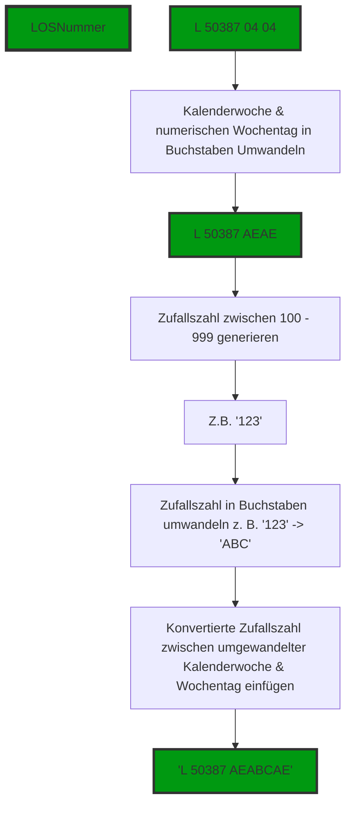

# Verschlüsseln von LOS Nummern  
Die Losnummer besteht aus vier Elementen und drei Leerzeichen:  
*"L" + " " + Erzeugernummer + " " + Kalenderwoche + " " + numerischer Wochentag*  
  
Ziel ist es; die Losnummer zu verschlüsseln, so dass die einzelnen Elemente nicht mehr erkennbar sind.  
Die Verschlüsselung soll so sein, dass die einzelnen Elemente wiederherstellbar sind.  
   
